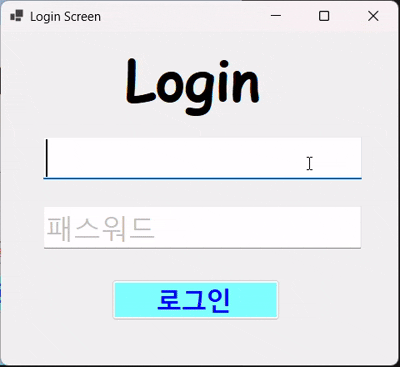

# (C# 코딩) 로그인스크린

## 개요
- C# 프로그래밍 학습
- 1줄 소개: 아이디와 암호를 검사하여 일치할 때만 화면을 보여주는 시스템
- 사용한 플랫폼: 
  - C#, .NET Windows Forms, Visual Studio, GitHub
- 사용한 컨트롤:
  - Label, TextBox, Button
- 사용한 기술과 구현한 기능:
  - TextBox와 Button Label을 적절히 배치하여 로그인 스크린을 구현 및 로그인 기능 구현
  - 패스워드 입력시 내용이 보이지 않게 처리 
  - 아이디와 패스워드가 일치할 때만 로그인 성공 메시지 보여주기
  - 아이디와 패스워드가 일치하지 않을 때 에러 메시지를 아이디와 메시지를 입력하는 곳에 보여주기
  - 이디와 패스워드를 Enter키를 이용해 빠르게 입력하여 로그인이 신속하게 이루어지도록 하기

## 실행 화면 (과제1)
- 과제1 코드의 실행 스크린샷

.png)
.png)

- 과제 내용
  - 컨트롤 배치와 기본적인 속성 설정
  - PlaceHolder로 입력창 안내하는 기능 구현
  - 아이디와 패스워드 처리 기능 구현

- 구현 내용과 기능 설명
  - TextBox와 Button 등을 적절히 배치하여 UI를 구성
  - Placeholder 표시
  - 아이디와 패스워드가 모두 맞아야 로그인이 허용되도록 로그인 가능 여부 판단
  - 로그인 성공, 실패에 따른 메시지 박스 보여주기

## 실행 화면 (과제2)
- 과제2 코드의 실행 스크린샷

- 과제 내용
  - 아이디 패스워드가 잘못 입력되었을 때 에러 메시지 보여주기
  - 에러는 메시지 박스로 보여주지 말고 아이디와 패스워드를 입력하는 곳에 보여주기
  - MessageBox를 띄우지 말고 아이디와 패스워드를 입력하는 곳에 보여주기

- 구현 내용과 기능 설명
  - 에러 메시지를 출력하기 위해 Label 컨트롤을 추가
  - Label의 Visible 속성을 활용하여, 에러 발생 시 메시지를 표시하고 정상 입력 시에는 숨기도록 구현

## 실행 화면 (과제3)
- 과제3 코드의 실행 스크린샷

- 과제 내용
  - UX 개선
  - 아이디와 패스워드를 Enter키를 이용해 빠르게 입력하여 로그인이 신속하게 이루어지도록 하기

- 구현 내용과 기능 설명
  - 아이디를 입력하고 Enter키를 치면 패스워드 입력창으로 넘어가기
  - 패스워드를 입력하고 Enter키를 치면 로그인 시작하기